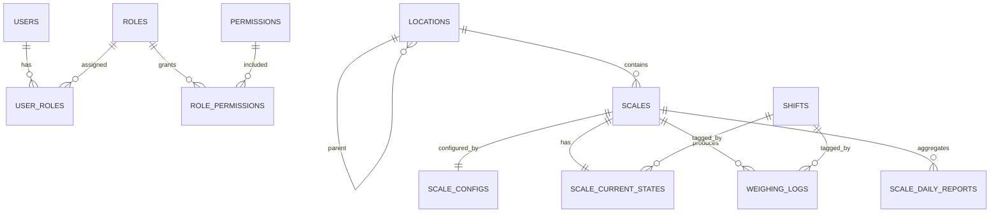

# `db_diagram.md`

## ScaleHub IoT – Database Design Specification (v1.1 – Audit & Time-aware)

---

## 0. Quy ước chung (RẤT QUAN TRỌNG)

### 0.1. Audit fields (áp dụng cho **tất cả các bảng**)

Mỗi bảng đều có:
```
    created_at TIMESTAMPTZ NOT NULL DEFAULT now(),
    created_by varchar(256),
    updated_at TIMESTAMPTZ NOT NULL DEFAULT now(),
    updated_by varchar(256),
```

> `created_by / updated_by`:

* NULL nếu thao tác bởi system / engine
* Có giá trị nếu thao tác từ UI / API

---

### 0.2. Thời gian đọc dữ liệu thực tế

* Các bảng **realtime / history** có thêm:

```sql
last_time TIMESTAMPTZ NOT NULL
```

`last_time` = **thời điểm thiết bị trả dữ liệu**,
KHÔNG phải thời điểm insert DB.

---

## 1. ERD (cập nhật)



---

## 2. Table Definitions (FULL)

---

## A. Users & RBAC

### `users`

```sql
CREATE TABLE users (
    id BIGSERIAL PRIMARY KEY,
    created_at TIMESTAMPTZ NOT NULL DEFAULT now(),
    created_by varchar(256),
    updated_at TIMESTAMPTZ NOT NULL DEFAULT now(),
    updated_by varchar(256),
    username VARCHAR(50) UNIQUE NOT NULL,
    password_hash VARCHAR(255) NOT NULL,
    full_name VARCHAR(100),
    status SMALLINT DEFAULT 1,
);
```

---

### `roles`

```sql
CREATE TABLE roles (
    id SERIAL PRIMARY KEY,
    created_at TIMESTAMPTZ NOT NULL DEFAULT now(),
    created_by varchar(256),
    updated_at TIMESTAMPTZ NOT NULL DEFAULT now(),
    updated_by varchar(256),
    name VARCHAR(50) NOT NULL,
    code VARCHAR(50) UNIQUE NOT NULL,
);
```

---

### `permissions`

```sql
CREATE TABLE permissions (
    id SERIAL PRIMARY KEY,
    created_at TIMESTAMPTZ NOT NULL DEFAULT now(),
    created_by varchar(256),
    updated_at TIMESTAMPTZ NOT NULL DEFAULT now(),
    updated_by varchar(256),
    code VARCHAR(100) UNIQUE NOT NULL,
    description TEXT,
);
```

---

### `user_roles`

```sql
CREATE TABLE user_roles (
    created_at TIMESTAMPTZ NOT NULL DEFAULT now(),
    created_by varchar(256),
    updated_at TIMESTAMPTZ NOT NULL DEFAULT now(),
    updated_by varchar(256),
    user_id BIGINT REFERENCES users(id) ON DELETE CASCADE,
    role_id INT REFERENCES roles(id) ON DELETE CASCADE,
    PRIMARY KEY (user_id, role_id)
);
```

---

### `role_permissions`

```sql
CREATE TABLE role_permissions (
    role_id INT REFERENCES roles(id) ON DELETE CASCADE,
    created_at TIMESTAMPTZ NOT NULL DEFAULT now(),
    created_by varchar(256),
    updated_at TIMESTAMPTZ NOT NULL DEFAULT now(),
    updated_by varchar(256),
    permission_id INT REFERENCES permissions(id) ON DELETE CASCADE,

    PRIMARY KEY (role_id, permission_id)
);
```

---

## B. Location

### `locations`

```sql
CREATE TABLE locations (
    id BIGSERIAL PRIMARY KEY,
    created_at TIMESTAMPTZ NOT NULL DEFAULT now(),
    created_by varchar(256),
    updated_at TIMESTAMPTZ NOT NULL DEFAULT now(),
    updated_by varchar(256),
    code VARCHAR(20) UNIQUE NOT NULL,
    name VARCHAR(100),
    parent_id BIGINT REFERENCES locations(id),
);

CREATE INDEX idx_locations_parent ON locations(parent_id);
```

---

## C. Scales & Config

### `scales`

```sql
CREATE TABLE scales (
    id BIGSERIAL PRIMARY KEY,
    created_at TIMESTAMPTZ NOT NULL DEFAULT now(),
    created_by varchar(256),
    updated_at TIMESTAMPTZ NOT NULL DEFAULT now(),
    updated_by varchar(256),
    name VARCHAR(100) NOT NULL,
    location_id BIGINT REFERENCES locations(id),
    model VARCHAR(50),
    is_active BOOLEAN DEFAULT true,
);

CREATE INDEX idx_scales_location ON scales(location_id);
```

---

### `scale_configs`

```sql
CREATE TABLE scale_configs (
    scale_id BIGINT PRIMARY KEY REFERENCES scales(id),
    created_at TIMESTAMPTZ NOT NULL DEFAULT now(),
    created_by varchar(256),
    updated_at TIMESTAMPTZ NOT NULL DEFAULT now(),
    updated_by varchar(256),
    protocol VARCHAR(20) NOT NULL,
    poll_interval INT DEFAULT 1000,
    conn_params JSONB NOT NULL,

    data_1 JSONB,
    data_2 JSONB,
    data_3 JSONB,
    data_4 JSONB,
    data_5 JSONB,
);
```

---

## D. Realtime State

### `scale_current_states`

```sql
CREATE TABLE scale_current_states (
    scale_id BIGINT PRIMARY KEY REFERENCES scales(id),
    created_at TIMESTAMPTZ NOT NULL DEFAULT now(),
    created_by varchar(256),
    updated_at TIMESTAMPTZ NOT NULL DEFAULT now(),
    updated_by varchar(256),
    data_1 varchar(256),
    data_2 varchar(256),
    data_3 varchar(256),
    data_4 varchar(256),
    data_5 varchar(256),
    status VARCHAR(20),
    shift_id BIGINT REFERENCES shifts(id),
    last_time TIMESTAMPTZ NOT NULL,
);
```

---

## E. Historical Logs

### `weighing_logs`

```sql
CREATE TABLE weighing_logs (
    scale_id BIGINT REFERENCES scales(id),
    created_at TIMESTAMPTZ NOT NULL DEFAULT now(),
    created_by varchar(256),
    updated_at TIMESTAMPTZ NOT NULL DEFAULT now(),
    updated_by varchar(256),
    last_time TIMESTAMPTZ NOT NULL,

    shift_id BIGINT REFERENCES shifts(id),

    data_1 varchar(256),
    data_2 varchar(256),
    data_3 varchar(256),
    data_4 varchar(256),
    data_5 varchar(256),
    PRIMARY KEY (scale_id, created_at)
) PARTITION BY RANGE (created_at);

---

## F. Shift Management

### `shifts`

```sql
CREATE TABLE shifts (
    id BIGSERIAL PRIMARY KEY,
    created_at TIMESTAMPTZ NOT NULL DEFAULT now(),
    created_by varchar(256),
    updated_at TIMESTAMPTZ NOT NULL DEFAULT now(),
    updated_by varchar(256),
    code VARCHAR(50) UNIQUE NOT NULL,
    name VARCHAR(100),
    start_time TIME,
    end_time TIME,
    is_active BOOLEAN DEFAULT true
);
```
```

Index:

```sql
CREATE INDEX idx_logs_scale_time
ON weighing_logs (scale_id, created_at DESC);
```

---

## F. Daily Aggregation

### `scale_daily_reports`

```sql
CREATE TABLE scale_daily_reports (
    created_at TIMESTAMPTZ NOT NULL DEFAULT now(),
    created_by varchar(256),
    updated_at TIMESTAMPTZ NOT NULL DEFAULT now(),
    updated_by varchar(256),
    date DATE NOT NULL,
    scale_id BIGINT REFERENCES scales(id),

    data_1 varchar(256),
    data_2 varchar(256),
    data_3 varchar(256),
    data_4 varchar(256),
    data_5 varchar(256),
    last_time TIMESTAMPTZ NOT NULL,
    PRIMARY KEY (date, scale_id)
);
```

---

## G. Report Configuration (Dynamic)

### `organization_settings`
Cấu hình thông tin công ty và branding

```sql
CREATE TABLE organization_settings (
    id SERIAL PRIMARY KEY,
    created_at TIMESTAMPTZ NOT NULL DEFAULT now(),
    created_by varchar(256),
    updated_at TIMESTAMPTZ NOT NULL DEFAULT now(),
    updated_by varchar(256),
    
    -- Company info
    company_name VARCHAR(255) NOT NULL,
    company_name_en VARCHAR(255),
    address TEXT,
    phone VARCHAR(50),
    email VARCHAR(100),
    website VARCHAR(255),
    tax_code VARCHAR(50),
    
    -- Branding
    logo_url TEXT,
    logo_data BYTEA,  -- Binary data cho logo
    watermark_text VARCHAR(100),
    
    -- Default settings
    is_active BOOLEAN DEFAULT true,
    is_default BOOLEAN DEFAULT false
);
```

---

### `report_templates`
Template động cho các loại báo cáo

```sql
CREATE TABLE report_templates (
    id SERIAL PRIMARY KEY,
    created_at TIMESTAMPTZ NOT NULL DEFAULT now(),
    created_by varchar(256),
    updated_at TIMESTAMPTZ NOT NULL DEFAULT now(),
    updated_by varchar(256),
    
    -- Template info
    code VARCHAR(50) UNIQUE NOT NULL,
    name VARCHAR(200) NOT NULL,
    description TEXT,
    report_type VARCHAR(20) NOT NULL,  -- EXCEL, WORD, PDF
    
    -- Configuration
    title_template VARCHAR(500),  -- e.g. "BÁO CÁO SẢN LƯỢNG - {{dateRange}}"
    
    -- Styling (JSONB for flexibility)
    header_config JSONB,  -- {showLogo, showCompanyInfo, headerColor, etc.}
    footer_config JSONB,  -- {showPageNumber, footerText, signatureFields, etc.}
    table_config JSONB,   -- {headerColor, borderStyle, fontSize, etc.}
    
    -- Status
    is_active BOOLEAN DEFAULT true,
    is_default BOOLEAN DEFAULT false,
    
    CONSTRAINT chk_report_type CHECK (report_type IN ('EXCEL', 'WORD', 'PDF'))
);

CREATE INDEX idx_report_templates_type ON report_templates(report_type, is_active);
```

---

### `report_columns`
Cấu hình động các cột trong báo cáo

```sql
CREATE TABLE report_columns (
    id SERIAL PRIMARY KEY,
    created_at TIMESTAMPTZ NOT NULL DEFAULT now(),
    created_by varchar(256),
    updated_at TIMESTAMPTZ NOT NULL DEFAULT now(),
    updated_by varchar(256),
    
    template_id INT REFERENCES report_templates(id) ON DELETE CASCADE,
    
    -- Column definition
    column_key VARCHAR(50) NOT NULL,     -- e.g. "data_1", "scale_name"
    column_label VARCHAR(200) NOT NULL,   -- e.g. "Khối lượng (kg)"
    column_order INT NOT NULL,
    
    -- Data mapping
    data_source VARCHAR(50) NOT NULL,     -- SCALE_INFO, WEIGHING_DATA, CALCULATED
    data_field VARCHAR(50),               -- Field name in source
    data_type VARCHAR(20),                -- STRING, NUMBER, DATE, BOOLEAN
    
    -- Formatting
    format_pattern VARCHAR(100),          -- e.g. "#,##0.00" for numbers
    aggregation_type VARCHAR(20),         -- SUM, AVG, MAX, MIN, COUNT, NONE
    
    -- Display
    is_visible BOOLEAN DEFAULT true,
    width INT,                            -- Column width (for Excel/Word)
    alignment VARCHAR(10),                -- LEFT, CENTER, RIGHT
    
    CONSTRAINT chk_data_source CHECK (data_source IN ('SCALE_INFO', 'WEIGHING_DATA', 'CALCULATED')),
    CONSTRAINT chk_aggregation CHECK (aggregation_type IN ('SUM', 'AVG', 'MAX', 'MIN', 'COUNT', 'NONE'))
);

CREATE INDEX idx_report_columns_template ON report_columns(template_id, column_order);
```

---

### `report_export_logs`
Audit trail cho việc xuất báo cáo

```sql
CREATE TABLE report_export_logs (
    id BIGSERIAL PRIMARY KEY,
    created_at TIMESTAMPTZ NOT NULL DEFAULT now(),
    created_by varchar(256),
    updated_at TIMESTAMPTZ NOT NULL DEFAULT now(),
    updated_by varchar(256),
    
    template_id INT REFERENCES report_templates(id),
    
    -- Request info
    export_type VARCHAR(20) NOT NULL,
    start_time TIMESTAMPTZ NOT NULL,
    end_time TIMESTAMPTZ NOT NULL,
    scale_ids JSONB,                      -- Array of scale IDs
    
    -- Result
    file_name VARCHAR(500),
    file_size BIGINT,
    record_count INT,
    status VARCHAR(20) NOT NULL,          -- SUCCESS, FAILED, TIMEOUT
    error_message TEXT,
    
    -- Performance
    execution_time_ms BIGINT,
    
    CONSTRAINT chk_export_status CHECK (status IN ('SUCCESS', 'FAILED', 'TIMEOUT'))
);

CREATE INDEX idx_export_logs_created ON report_export_logs(created_at DESC);
CREATE INDEX idx_export_logs_user ON report_export_logs(created_by, created_at DESC);
```

---

## 3. Design Notes (Enterprise-grade)

* `last_time` ≠ `created_at`
* **Dynamic Configuration**: Report templates được cấu hình hoàn toàn động qua JSONB
* **Multi-tenant Ready**: `organization_settings` cho phép multiple organizations
* **Flexible Columns**: `report_columns` mapping động, không hardcode
* **Audit Trail**: `report_export_logs` theo dõi toàn bộ lịch sử xuất báo cáo