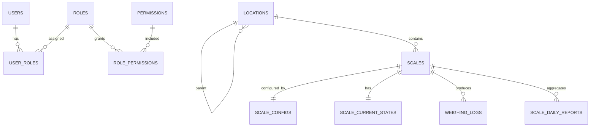

# `db_diagram.md`

## ScaleHub IoT – Database Design Specification (v1.1 – Audit & Time-aware)

---

## 0. Quy ước chung (RẤT QUAN TRỌNG)

### 0.1. Audit fields (áp dụng cho **tất cả các bảng**)

Mỗi bảng đều có:
```
    created_at TIMESTAMPTZ NOT NULL DEFAULT now(),
    created_by varchar(256),
    updated_at TIMESTAMPTZ NOT NULL DEFAULT now(),
    updated_by varchar(256),
```

> `created_by / updated_by`:

* NULL nếu thao tác bởi system / engine
* Có giá trị nếu thao tác từ UI / API

---

### 0.2. Thời gian đọc dữ liệu thực tế

* Các bảng **realtime / history** có thêm:

```sql
last_time TIMESTAMPTZ NOT NULL
```

`last_time` = **thời điểm thiết bị trả dữ liệu**,
KHÔNG phải thời điểm insert DB.

---

## 1. ERD (cập nhật)



---

## 2. Table Definitions (FULL)

---

## A. Users & RBAC

### `users`

```sql
CREATE TABLE users (
    id BIGSERIAL PRIMARY KEY,
    created_at TIMESTAMPTZ NOT NULL DEFAULT now(),
    created_by varchar(256),
    updated_at TIMESTAMPTZ NOT NULL DEFAULT now(),
    updated_by varchar(256),
    username VARCHAR(50) UNIQUE NOT NULL,
    password_hash VARCHAR(255) NOT NULL,
    full_name VARCHAR(100),
    status SMALLINT DEFAULT 1,
);
```

---

### `roles`

```sql
CREATE TABLE roles (
    id SERIAL PRIMARY KEY,
    created_at TIMESTAMPTZ NOT NULL DEFAULT now(),
    created_by varchar(256),
    updated_at TIMESTAMPTZ NOT NULL DEFAULT now(),
    updated_by varchar(256),
    name VARCHAR(50) NOT NULL,
    code VARCHAR(50) UNIQUE NOT NULL,
);
```

---

### `permissions`

```sql
CREATE TABLE permissions (
    id SERIAL PRIMARY KEY,
    created_at TIMESTAMPTZ NOT NULL DEFAULT now(),
    created_by varchar(256),
    updated_at TIMESTAMPTZ NOT NULL DEFAULT now(),
    updated_by varchar(256),
    code VARCHAR(100) UNIQUE NOT NULL,
    description TEXT,
);
```

---

### `user_roles`

```sql
CREATE TABLE user_roles (
    created_at TIMESTAMPTZ NOT NULL DEFAULT now(),
    created_by varchar(256),
    updated_at TIMESTAMPTZ NOT NULL DEFAULT now(),
    updated_by varchar(256),
    user_id BIGINT REFERENCES users(id) ON DELETE CASCADE,
    role_id INT REFERENCES roles(id) ON DELETE CASCADE,
    PRIMARY KEY (user_id, role_id)
);
```

---

### `role_permissions`

```sql
CREATE TABLE role_permissions (
    role_id INT REFERENCES roles(id) ON DELETE CASCADE,
    created_at TIMESTAMPTZ NOT NULL DEFAULT now(),
    created_by varchar(256),
    updated_at TIMESTAMPTZ NOT NULL DEFAULT now(),
    updated_by varchar(256),
    permission_id INT REFERENCES permissions(id) ON DELETE CASCADE,

    PRIMARY KEY (role_id, permission_id)
);
```

---

## B. Location

### `locations`

```sql
CREATE TABLE locations (
    id BIGSERIAL PRIMARY KEY,
    created_at TIMESTAMPTZ NOT NULL DEFAULT now(),
    created_by varchar(256),
    updated_at TIMESTAMPTZ NOT NULL DEFAULT now(),
    updated_by varchar(256),
    code VARCHAR(20) UNIQUE NOT NULL,
    name VARCHAR(100),
    parent_id BIGINT REFERENCES locations(id),
);

CREATE INDEX idx_locations_parent ON locations(parent_id);
```

---

## C. Scales & Config

### `scales`

```sql
CREATE TABLE scales (
    id BIGSERIAL PRIMARY KEY,
    created_at TIMESTAMPTZ NOT NULL DEFAULT now(),
    created_by varchar(256),
    updated_at TIMESTAMPTZ NOT NULL DEFAULT now(),
    updated_by varchar(256),
    name VARCHAR(100) NOT NULL,
    location_id BIGINT REFERENCES locations(id),
    model VARCHAR(50),
    is_active BOOLEAN DEFAULT true,
);

CREATE INDEX idx_scales_location ON scales(location_id);
```

---

### `scale_configs`

```sql
CREATE TABLE scale_configs (
    scale_id BIGINT PRIMARY KEY REFERENCES scales(id),
    created_at TIMESTAMPTZ NOT NULL DEFAULT now(),
    created_by varchar(256),
    updated_at TIMESTAMPTZ NOT NULL DEFAULT now(),
    updated_by varchar(256),
    protocol VARCHAR(20) NOT NULL,
    poll_interval INT DEFAULT 1000,
    conn_params JSONB NOT NULL,

    data_1 JSONB,
    data_2 JSONB,
    data_3 JSONB,
    data_4 JSONB,
    data_5 JSONB,
);
```

---

## D. Realtime State

### `scale_current_states`

```sql
CREATE TABLE scale_current_states (
    scale_id BIGINT PRIMARY KEY REFERENCES scales(id),
    created_at TIMESTAMPTZ NOT NULL DEFAULT now(),
    created_by varchar(256),
    updated_at TIMESTAMPTZ NOT NULL DEFAULT now(),
    updated_by varchar(256),
    data_1 JSONB,
    data_2 JSONB,
    data_3 JSONB,
    data_4 JSONB,
    data_5 JSONB,
    status VARCHAR(20),
    last_time TIMESTAMPTZ NOT NULL,
);
```

---

## E. Historical Logs

### `weighing_logs`

```sql
CREATE TABLE weighing_logs (
    scale_id BIGINT REFERENCES scales(id),
    created_at TIMESTAMPTZ NOT NULL DEFAULT now(),
    created_by varchar(256),
    updated_at TIMESTAMPTZ NOT NULL DEFAULT now(),
    updated_by varchar(256),
    last_time TIMESTAMPTZ NOT NULL,

    data_1 JSONB,
    data_2 JSONB,
    data_3 JSONB,
    data_4 JSONB,
    data_5 JSONB,
    PRIMARY KEY (scale_id, created_at)
) PARTITION BY RANGE (created_at);
```

Index:

```sql
CREATE INDEX idx_logs_scale_time
ON weighing_logs (scale_id, created_at DESC);
```

---

## F. Daily Aggregation

### `scale_daily_reports`

```sql
CREATE TABLE scale_daily_reports (
    created_at TIMESTAMPTZ NOT NULL DEFAULT now(),
    created_by varchar(256),
    updated_at TIMESTAMPTZ NOT NULL DEFAULT now(),
    updated_by varchar(256),
    date DATE NOT NULL,
    scale_id BIGINT REFERENCES scales(id),

    data_1 JSONB,
    data_2 JSONB,
    data_3 JSONB,
    data_4 JSONB,
    data_5 JSONB,
    last_time TIMESTAMPTZ NOT NULL,
    PRIMARY KEY (date, scale_id)
);
```

---

## G. Form Templates

### `form_templates`

```sql
CREATE TABLE form_templates (
    id SERIAL PRIMARY KEY,
    name VARCHAR(100),
    content TEXT,
    is_default BOOLEAN DEFAULT false,

    created_at TIMESTAMPTZ NOT NULL DEFAULT now(),
    created_by BIGINT REFERENCES users(id),
    updated_at TIMESTAMPTZ NOT NULL DEFAULT now(),
    updated_by BIGINT REFERENCES users(id)
);
```

---

## 3. Design Notes (Enterprise-grade)

* `last_time` ≠ `created_at`